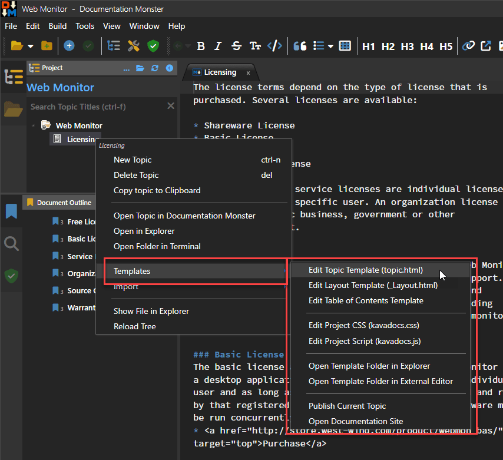

Documentation Monster is a documentation generation tool using a **Project** to manage a hierarchical list of topics.

### Overall Structure

* There's a top level Project
* The Project Contains Topics
* Each Topic can contain Sub-Topics

Topics are split into two types of information:

* The main Topic Content
* Topic Meta Data

### Main Topic Content - Markdown Files
The main topic content is shown in the center portion of Markdown Monster's User interface and that's where you're likely to do 95% of your work - creating content!

The main topic text is stored as Markdown files on disk and can also be edited externally without Documentation Monster's UI.

### Topic Meta Data - In the Project File
The topic meta data contains additional information about each topic: 

* Topic Id
* Title
* Topic Type (topic,header etc.)
* Additional Keywords
* Notes/Remarks
* Code Snippets
* Flags like Incomplete, Don't render, Topic is a link etc.
* Topic Type specific fields like Class data f

### Topic Type
The Topic Type associates each topic with a specific topic type. Topic types are used for several purposes:

* Associate an Icon
* Associate a Render Template
* Associate some specific behaviors for specialty types

For the most part you'll use only two topic types:

* topic
* header

But there are other more specialized types like  

* whatsnew
* externallink

and specialty types like:

* classheader, classproperty, classmethod etc.
* database, webservice etc.

#### Render Templates
The most important association is that of a Render Template. Each Topic type has a Render Template associated with it which you can access from the Topic Context Menu 



Render templates are Html documents with embedded expressions that render each topic's content data with a matching topic type name. So the `topic` type has a `topic.html` Render Template. The idea of these templates is that they are customizable so you can tweak the layout or how fields render. While most templates are very similar there are subtle differences depending on the topic type.

To get an idea of what a topic template  looks like here's a small Html excerpt of the `topic.html` template:

```html
{{%
    Script.Layout = "_kavadocs\\Themes\\_layout.html";    
}}
<h2 class="content-title">
    
    {{ Model.Topic.Title }}
</h2>

<div class="content-body" id="body">
    {{ Model.Helpers.Markdown(Model.Topic.Body) }}
</div>
```

It's plain Html with expressions that render the topic data. It gets more complex than this in places, but you probably get the idea.

There's also a `_layout.html` page that provides the 'site' chrome which provides the banner, footer and the navigation panel (which shows only in the final Html output). The templates are merged with the topic data to produce the Preview Html you see in the Preview panel, or the final Html output in the generated Web site.

### Ids, Slugs and Links
Topics are identified by a unique Id that is static and can't be directly changed (unless you explicitly hack the project file). You can always reference a topic by its Id and get the same topic back.

Topics are also identified by a **Slug** which identifies a topic by its encoded, url-safe title and the location in the hierarchy. Slugs are what's used to generate the eventual output file name and determines how you typically access a topic on the Web site.

Topics also have an associated **Link** which points at the content Markdown (.md) file which is used to load the content when a topic is accessed and rendered.


There are also some operational fields that provide information about location in the project for navigating

like the `Slug` which gives a unique path hierarchy dependent location and link which points at the project relative path to the content file.

The slug generally matches the location within the hierarchy, and when you move a topic via Drag and Drop, the slug and link are adjusted to reflect the new location. 

Topics are uniquely identified by an id and secondarily by a slug. An Id is static and never changes while a slug can potentially change when a topic is moved or renamed. 


The topic data is stored in the Project file, which is a JSON document that by default has a `.docmonster` extension (but can have any extension including a `.json` for easier access in other editors)