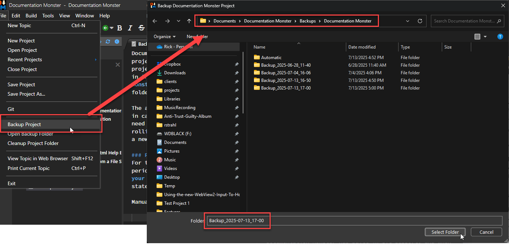

*"Better safe than sorry!"* as the old saying goes. 

In a perfect world you don't need any backups, but in the real world things go wrong or we make mistakes perhaps writing content into the wrong topic or perhaps topic data got corrupted due to a crash. 

*Stuff happens* after all!

You can manage backups in several ways:

* [Automatic Backups](#automatic-backups)
* [Manual Backup to Folder ](#please-backup-manually-too)
* [Manual Backup to Zip File](#backup-to-zip-file-saves-space)
* [Using Git for Backup](#alternately-use-git-for-backup)

### Automatic Backups
Documentation Monster automatically backs up your project when you start the application or open or create a project By default it keeps the last 5 rolling backups in the `%documents%\Documentation Monster\Backups\<yourProject>\Automatic` folder. The number of automatic backups is configurable via the **Automatic Backup Count** configuration setting.

> ##### @icon-warning Backup Size
> Backups on large projects tend to be sizable as they duplicate your entire project. So you want to weigh diskspace usage vs the number of backups you want to keep around carefully especially on larger projects.

Automatic backups are meant for emergency failures in case you save content that you didn't mean to and you need to roll back the immediate copy. Because content is backed up in full, you can retrieve individual files or the entire project. 

Keep in mind that automatic backups are rolling backups, meaning they eventually get replaced by a newer backup and eventually get replaced by newer backups.

### Please Backup Manually Too!
For this reason we highly recommend that you make periodic explicit backups of **known good versions of your project** that are not auto-deleted. This is to ensure you have known good state files that you can go back to.

Manual backups are available via the **File -> Backup Project** menu:

Project backups backup the entire project folder including the `.git` and `wwwroot` folders, so it's a full copy of the entire project that you can directly access and copy files out of.

By default files are backed up into a folder with `%userprofile%\Documents\Backups\<yourProject>\Backup_<date>` for quick access.

### Backup to Zip File saves Space
You can also back up to a Zip file in the same way which is more efficient in terms of disk space. But it also means you can't directly access the saved content.

### Open Backup Folder
There's another useful option, **File -> Open Backup Folder** on the menu that lets you quickly jump to the default backup folder which is useful if for some reason you need to replace a topic with old content that was previously saved.

While you can put backups wherever you chose we do recommend you use the default location to allow quick access to backups as needed.

### Alternately: Use Git for Backup
Documentation Monster has built-in Git support and automatically creates a new Git Repository when a new project is created if it is available. Git of course makes a great way to keep a complete history of your project with only incremental changes saved which makes it more efficient than backups. 

To commit, use the @icon-brands-git-alt Git icon on the toolbar or **File -> Git -> Commit to Git...** from the main menu to commit changes to your Git repository.

Using Git it's also possible to share your project on GitHub or other social Git hosting site. All DM's files are text based so it's ideally suited to Git repositories.

Git captures the entire project minus certain backup files and without the generated output `wwwroot` folder to reduce file churn. You can always re-generate the `wwwroot` folder output as needed.