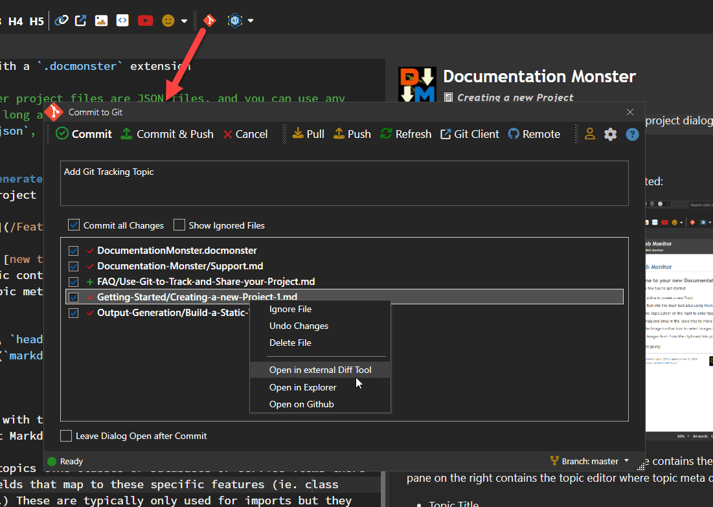
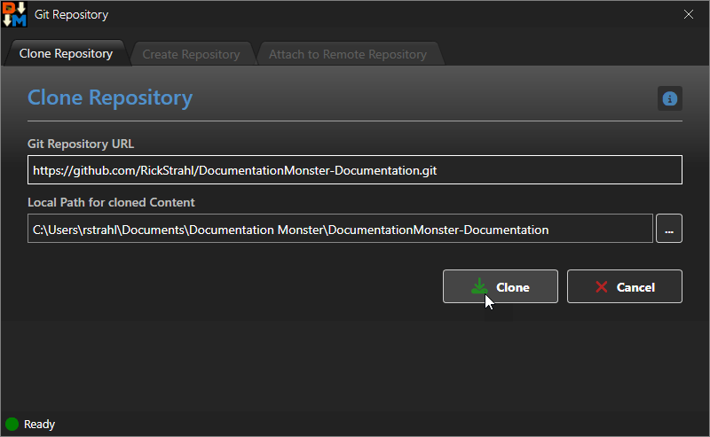

Git is almost universally supported these days for developer tasks and you can use Git with Documentation Monster to share and safely archive your documentation projects.

## Git Features 
Documentation Monster has a number of Git integration features:

* Interactive Git Commit Dialog
* New Projects automatically create a Git Repo
* Attach to Remote
* Push and Pull from Repo
* Open in external Diff Viewer
* Open in external Git Client


## Interactive Commit Dialog
Probably the most useful Git integration inside of Documentation Monster is the Git Commit dialog which shows you changed files in an existing repository and allows you review changes, commit and push them to the server.

This dialog also provides access to most other Git administration features like Clone, Create and Add Remote which can also be accessed from the **File->Git** menu.



> #### @icon-info-circle Git Repository must be active
> The Git Commit Dialog only works if you have an active Git repository to start with. If Git is not enabled you will first need to create the repo in the project folder either using the Git Repository support mentioned below (**File->Git** menu) or using the Git command line or an external Git client.

The dialog acts as a control center for all things Git. You can:

* Select Files to Commit
* Commit and Commit & Push
* Push and Pull
* Compare files in an external Diff client <small>*(configurable)*</small>
* Open an external Git Client <small>*(configurable)*</small>
* Open the Remote Web site (ie. GitHub, BitBucket, GitLab etc.)
* Create or Clone a Repository or Attach to a Remote
* Switch Branches

You can of course also use any external Git Client or the Git/GitHub Command Line tools to manage the project. 

## Git Repository Support
You can integrate with Git in a couple of ways:

* Create a new Project which creates a Repository
* Attach to an existing Project via Remote


### New Projects automatically create a Git Repository
When you create a new Documentation Monster project - and you have Git installed locally - DM automatically creates a new Git repository. The repo is created locally, so if you want to publish on GitHub or elsewhere you'll need to connect it to an online repository.

### Clone Repository
If there's an existing Git repo online that you want to use locally you can clone the Repo by going to:

* File Menu -> Git -> Clone Repository



> #### @icon-warning No Support for Authentication when Cloning
> There's no support for private repositories at the moment. If you need to clone a private repository please use the Git Command Line or another Git Tool to clone and create your folder.
>
> The recommended target location is at:
> ```text
> ~\Documents\Documentation Monster\YourProject
> ```
>
> However, once you've cloned your repo and the remote has been configured you can push to the private repo just fine from within Documentation Monster.

### Connect to a Remote
Although there's no support directly in Documentation Monster to create a new online repository, you can create one online and then attach to the remote. To do this