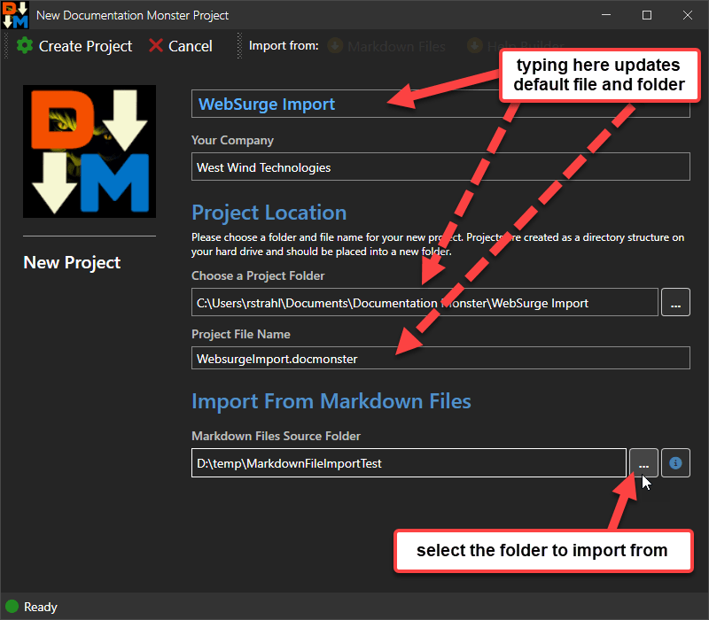
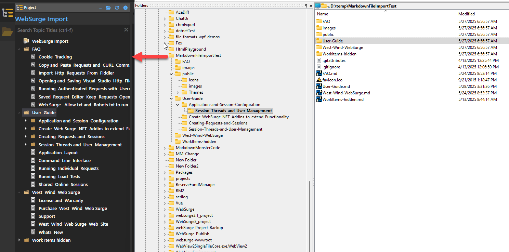
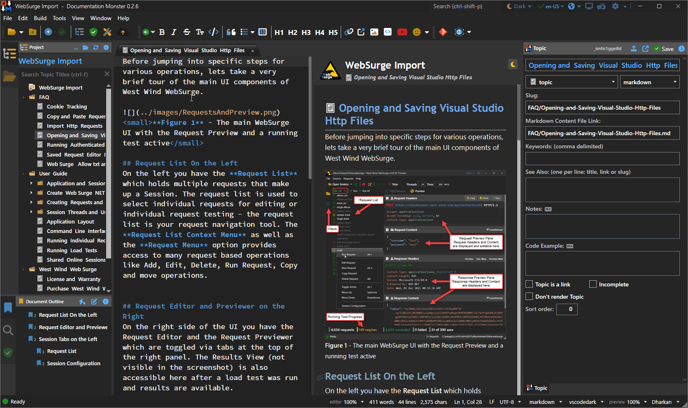

Documentation Monster can import Markdown files from a folder structure into a project. It does this by importing each Markdown file in a folder recursively, extracting a title from it and building a new project table of contents based on the folder structure. 

It's a quick way to import many markdown files into a Documentation Monster project.

## Create a new Project from Markdown Files
The easiest way to use this feature is:

* Go to the **Tools** Menu
* Choose **Import**
* Then **Import from Markdown Files**

This brings up New Project Dialog with the Markdown File Import options enabled.

> An alternate way to do this is use the @icon-folder-plus-color:goldenrod **New Project** icon on the toolbar, then select the *Import From:*  @icon-circle-arrow-down-color:goldenrod **Markdown Files** button.

Then click **Create Project**. 

The result of an import looks something like this. Shown here with the source folder from which content was imported (basically another project without the project file):

Here's another view of the raw imported project without any changes and the project content directly filled from the import. 

As mentioned the tree is populated based on the file structure, with titles coming from folder or filenames or if available embedded `h1` headers in the Markdown. Images are other dependencies are also moved if they are referenced via relative pathing with automatic

## What is imported
The import works like this:

* New topics are created from Files and Folders
* Folder topics are imported as type `header`
    * Topic title is derived from folder name
* Files are added as type `topic`
    * Topic title looks for `h1` headers 
    * Or: Topic title derived from filename
    * File name conversion from camel case, snake case or as-is
    * Markdown content is 'imported' as is (file stays unchanged)
* Images and other Assets are imported
    * Relative Paths are maintained
    * Root Paths are fixed up to `/` mapping the project path

> #### @icon-info-circle Your Mileage May Vary!
> How well the import works depends greatly on how well your folder structure and topics are named. If your folders use appropriate names, those titles import nicely. Likewise if your topics have `h1` header tags (`#` or `---` in Markdown) or use clear camel case or snake case file names, topic titles can be extracted. Failing that however you may not get clean titles and will have to fix up those titles in the topic metadata after importing.