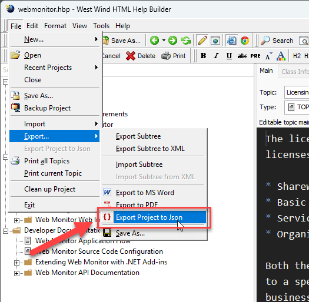
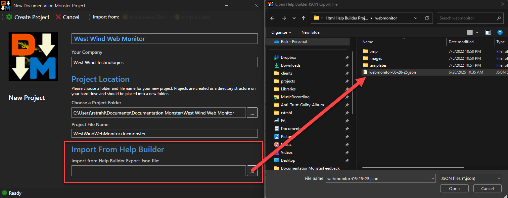

You can import West Wind Html Builder projects into Documentation Monster by:

* Creating an Export File in Help Builder
* Using **Tools -> Import -> Import from Help Builder**
* Use the Create Project Dialog
* Select your Help Builder Export file to import from

### Exporting from Html Help Builder
The first step is to create a Project Export file of your Help Builder project. 

* Open Html Help Builder
* Use **File -> Export -> Export Project to Json**
* Select an output filename

### Creating a new Project from a Help Builder Project
The next step is to essentially create a New Documentation Monster Project that imports topics from the Help Builder export file.

* Open Documentation  Monster
* Use **Tools -> Import -> Import From Html Help Builder**
* Fill out the new Project Dialog prompts
* Select the Html Help Builder Json file to import

