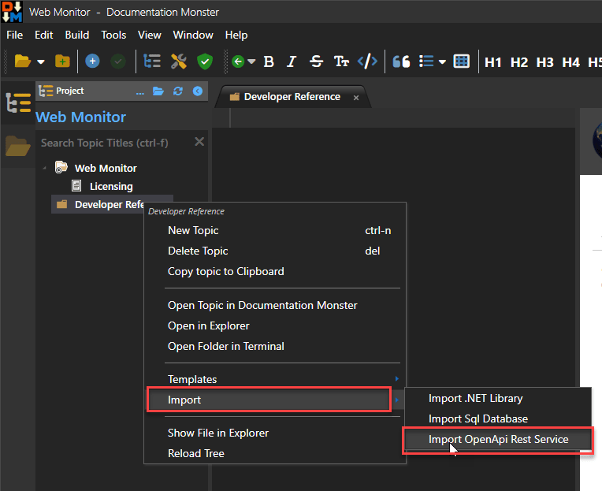
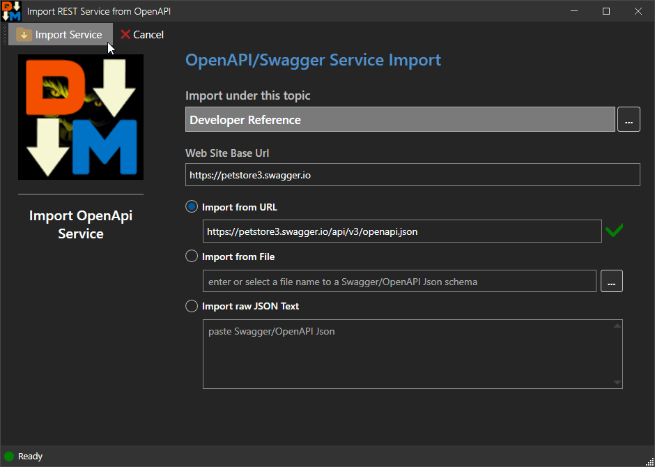
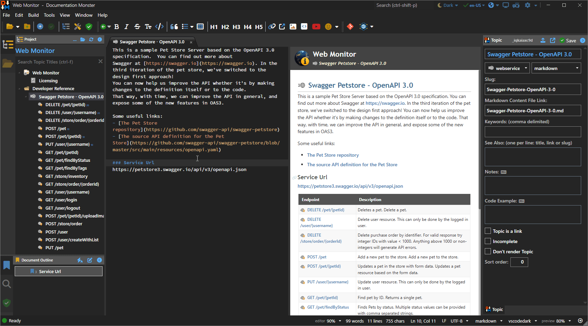
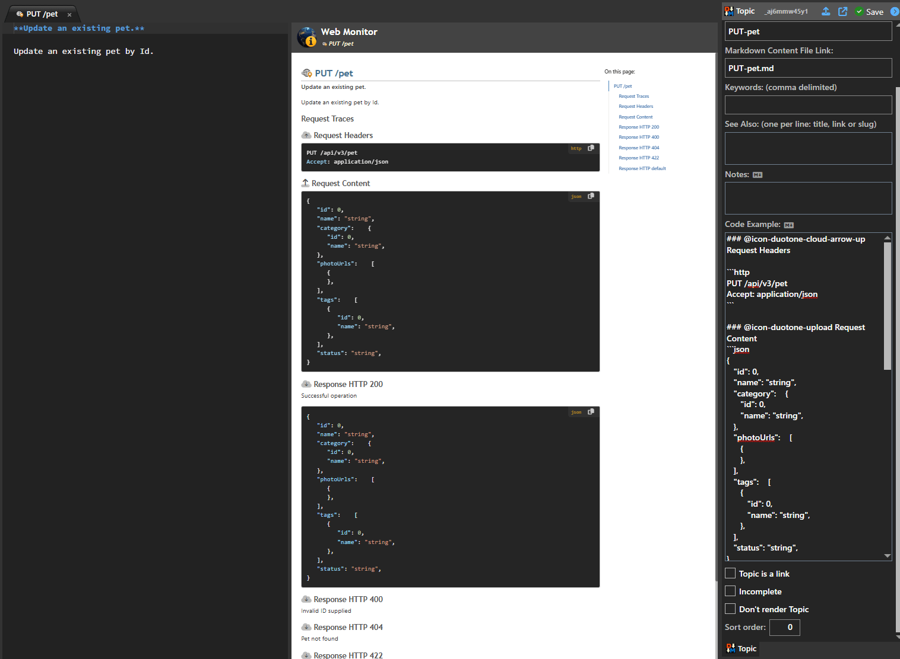

You can import service signatures using OpenApi or Swagger Service descriptions from a provided Url. Documentation Monster will import the service and its service endpoints along with any information provided by the online documentation.

### Importing an OpenApi Service
To start by navigating to or creating a topic **under which** the service will be imported. Below I'm using the *Developer Reference* topic as the parent topic, then use the context menu:

You can also access this same link from **Tools -> Import -> Import OpenApi Rest Service**. Once you get there you see the following dialog:

In this dialog you can specify OpenApi or Swagger content from:

* **Online Url**  
Allows you to directly access an OpenApi service definition from its Json or Yaml metadata and import from there.

* **From a local File**   
Allows you to import Json or Yaml from the local file system to import the service.

* **From the Clipboard**  
Allows you to paste OpenApi/Swagger Json or Xml meta data to import the service.

### The Imported OpenApi Service
Once you've chosen a format and assuming the import is successful you'll get an imported service that looks something like this:

The service is imported as the top level node with title and description pulled in. The WebService topic then lists all the endpoints.

Individual topics also retrieve Title and Description if available, and also show the Request and Response traces if available in raw Http format:

> Note: The imported data depends on what the OpenApi metadata contains. Often things like title and description are not set, and response data may not be available for all endpoints.

### Re-Importing a Service
If you are importing services it's likely that services will change. If possible the easiest way to do this is to simply delete the service reference in the topic tree and re-import.

However, if you end up customizing the service or its endpoints explicitly, then a wholesale delete and re-import doesn't work. In that scenario you have a few choices:

* **Manually Update Topics after initial Import**  
If you are making many manual changes to service imports this is likely your best option to keep topic content properly updated with custom changes.

* **Import separately and then Copy Topics**  
If your service adds multiple new endpoints it might be useful to import the updated service into a separate temporary node in your Project and then explicitly copy topics from that node into your previous imported service hierarchy. Documentation Monster makes it to make a full copy of a topic, and then paste it as a new topic in a new location. You can also do this in a separate project altogether to avoid having to clean up your working project.