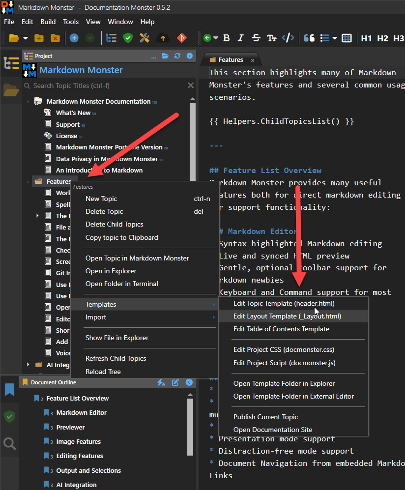
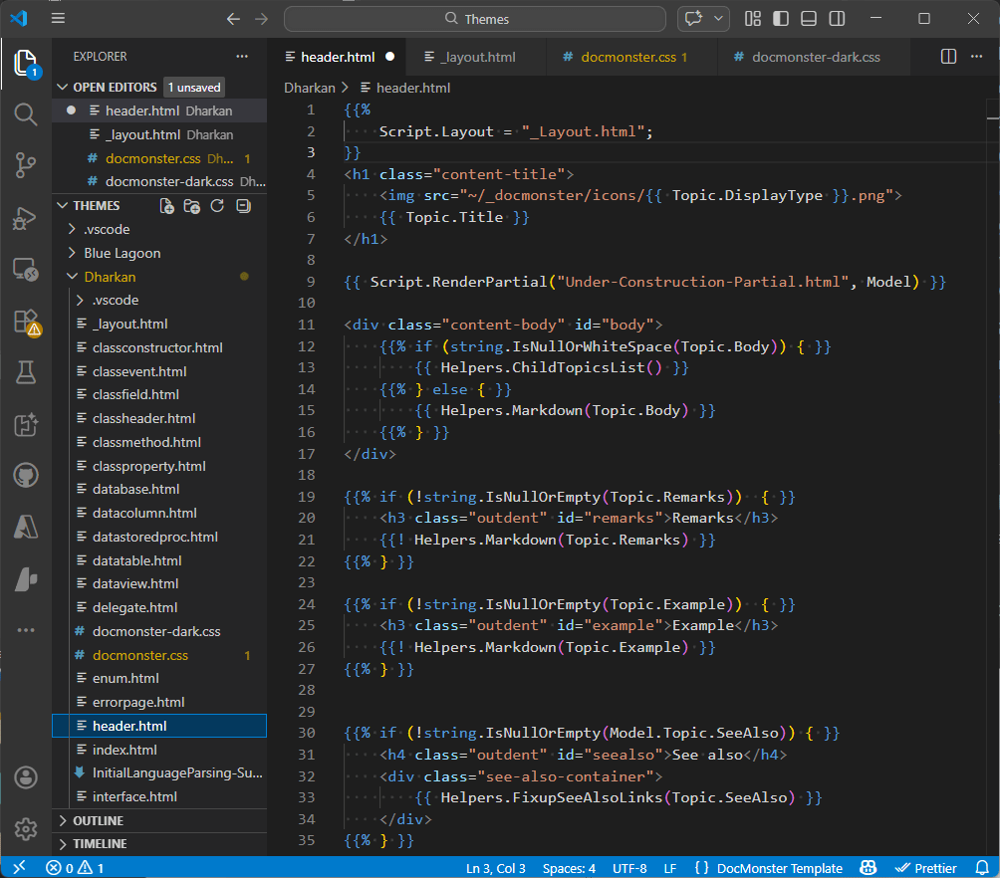
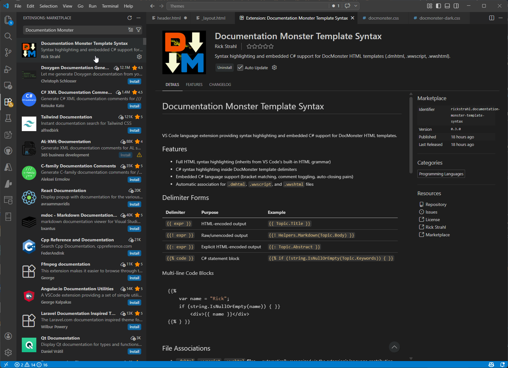

Each project has its own set of templates which are copied from the master templates that DM provides. When a new project is created DM copies the master templates into the new project folder.

> You can also update the templates to the latest version in your existing project by using **Build -> Update Output Scripts and Templates**. A backup of the old templates is created so you can sync up any modifications you have made if necessary. [more info](dm-topic://_3v1etztqbv)

Because **templates are project specific** you can customize the templates in any way you see fit. 

## Accessing Templates
Templates live in your project folder in the `_docmonster\Themes` folder. Two built-in themes - **Dharkan** and **Blue Lagoon** - are provided and both provide both a light and dark mode (*Blue Lagoon is more like dark and darker*  :smile:)

The easiest way to find and edit templates is through the Topic Tree's context menu which takes you directly to various template editing options:



You can either directly jump to and edit the active topic's template (`header.dmhtml` in the example) from the first option, or open the layout or CSS and script files.

You can also open the template `Themes` folder in an external editor like VS Code where you can see all the templates and scripts in one place for editing. This is my preferred mode of working since I typically look at minimum and the template and the Css.

## Template Format
Templates use a Handlebars variant with embedded C# `{{ expression }}` and `{{% code block }}` blocks that are responsible for producing topic Html output.



The templates mostly use expressions that reference specific topic and project properties to display as part of the template. Code blocks are used to some degree to conditionally render certain sections depending on whether values are set or not.

The templates compile in C# executable code so you can take advantage of any C#/.NET Core features for formatting or even custom logic in your templates.

Note that topic templates reference Layout page at the top of the file with:

```html
{{%
    Script.Layout = "_layout.html";
}}
```
`_layout.html` provides the top level Html layout for the page and which contains a `{{ Script.RenderContent() }}` block, where the topic page content is loaded. The layout page holds the Html header, loads most scripts, css and other dependencies, sets the Html page identifier tags etc.

If you do decide to edit templates, one of the best ways to edit templates is to open the template folder in an **External Editor** like Visual Studio Code as you can look at all templates all at once.

> #### @icon-lightbulb Install the Documentation Monster Syntax VS Code Extension   
> You can install the VS Code Documentation Monster Syntax Extension which provides improved syntax color highlighting for the template files.  
> 


## Visual Studio Code Extension
To make it easier to write scripts

