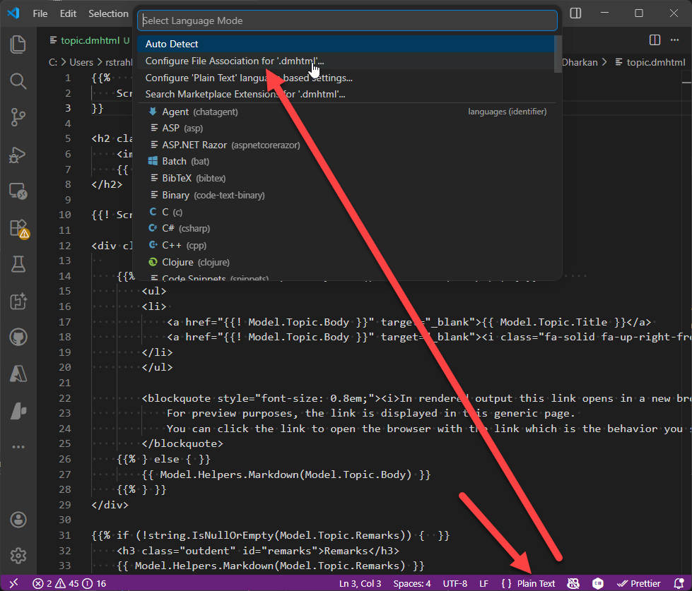
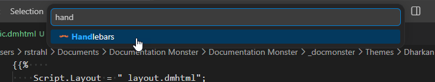

Documentation Monster by default uses extensions with a `.dmhtml` extension, which is an Html derived template that uses Html, Handlebars and the C# dialect that DM uses.

## Using the Documentation Monster Template Syntax VS Code Extension
If you have VS Code installed on your machine, installing Documentation Monster should in most cases automatically install the Documentation Monster Syntax extension for you when the installer runs.

If for some reason that's not the case (some admin permissions may not allow for it) you can explicitly install the extension from the Extensions tab in VS Code:

## What does it Provide
The VS Code offers better syntax coloring for the Documentation Monster Handlebars and C# syntax separating the C# content cleanly and without errors:

Any Html, CSS and Javascript in an Html document works with the full functionality of the Html editor features native in VS Code. You get syntax coloring, and full Intellisense with dropdown selection and CoPilot AI completions.

The functionality of the C# portion of the extension is limited to basic syntax coloring of standard C# keyword and CoPilot AI Completions based on context. There's no support for full Intellisense of either core .NET features or the Documentation Monster object model. 

This may be added in the future but currently using the basic TextMate syntax providers available in VS Code, it's not possible to provide the mixed input and custom model provider.

## Bare Metal VS Code (without Extension)
If for some reason you can't or don't want to use the extension you can also do a native mapping to these syntaxes:

* **Html** 
* **Handlebars** 

They provides full Html Intellisense with basic Handlebars highlighting, but no C# code highlighting. You may see some errors with structure C# code blocks especially related to brackets in code blocks that flag as red errors. You can ignore those, but they distract.

The Handlebars syntax deals a bit better with these scenarios than the plain Html syntax in handling nested `{{ }}` delimiters.

To set up the syntax file extension binding, click on the syntax item on the statusbar in VS Code window and select **Configure File Association for .dmhtml**:

Then pick either Handlebars or Html:

