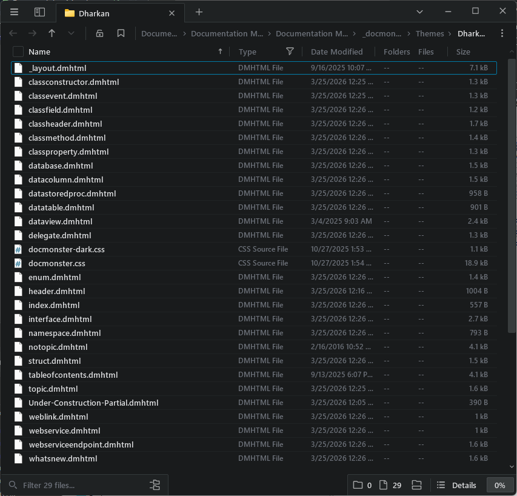

Documentation Monster uses Html based templates to render topics and the templates are customizable to create your own custom help layouts. 

Each topic has a related **topic type** which corresponds to a matching template. So the `topic` type has a corresponding `topic.html` template. There's also a **master layout** page `_layout.html` that handles rendering of the main window layout (header, footer, table of contents area) into which each topic renders.

There are two templates that are shipped and each lives in its own separate folder:

* Dharkan
* Blue Lagoon

Both themes can switch between light and dark modes *(although Blue Lagoon is more dark and darker :smile:)*, that have built-in UI toggle to switch between these modes.

## Template Structure
As mentioned templates live in your project's `_docmonster\Themes` folder:



Each topic type - topic, header, classheader, classproperty, classmethod etc. - has its own  `topictype.dmhtml` template that renders each topic accordingly. All topics render their body the same, but some topics like Class related topics may render additional information like return values, parameter or inheritance, location for classes and so on.

All topic templates reference `_layout.dmhtml` which provides the overall page layout and loads up all the required Html dependencies scripts and css and also the table of contents in the final rendered Html output.

> #### @icon-lightbulb Quickly access templates via Topic Tree
You can quickly access a template from the Topic Tree by using the Context menu on the active topic and selecting `Templates...`. 
> 


## Topics and Layout
To give you an idea what templates look like, here's the topic template.

```html
{{%    
    Script.Layout = "_layout.dmhtml";
}}

<h2 class="content-title">
    
    {{ Model.Topic.Title }}
</h2>

{{! Script.RenderPartial($"Under-Construction-Partial.dmhtml", Model) }}

<div class="content-body" id="body">
  
    {{% if (Topic.IsLink && Topic.Body.Trim().StartsWith("http") ) { }}        
        <ul>
        <li> 
            <a href="{{! Model.Topic.Body }}" target="_blank">{{ Model.Topic.Title }}</a> 
            <a href="{{! Model.Topic.Body }}" target="_blank"><i class="fa-solid fa-up-right-from-square" style="font-size: 0.7em; vertical-align: super;"></i></a>
        </li>
        </ul>
        
        <blockquote style="font-size: 0.8em;"><i>In rendered output this link opens in a new browser window. 
            For preview purposes, the link is displayed in this generic page. 
            You can click the link to open the browser with the link which is the behavior you see when rendered.</i>
        </blockquote>
    {{% } else { }}
        {{ Model.Helpers.Markdown(Model.Topic.Body) }}
    {{% } }}
</div>

{{% if (!string.IsNullOrEmpty(Model.Topic.Remarks)) {  }}
    <h3 class="outdent" id="remarks">Remarks</h3>
    {{ Model.Helpers.Markdown(Model.Topic.Remarks) }}
{{% } }}

{{% if (!string.IsNullOrEmpty(Model.Topic.Example))  {  }}
    <h3 class="outdent" id="example">Example</h3>
    {{ Model.Helpers.Markdown(Model.Topic.Example) }}
{{% } }}

{{% if (!string.IsNullOrEmpty(Model.Topic.SeeAlso)) { }}
    <h4 class="outdent" id="seealso">See also</h4>
    <div class="see-also-container">
        {{ Helpers.FixupSeeAlsoLinks(Topic.SeeAlso) }}
    </div>
{{% } }}
```

<small>*it'll look a lot nicer in the editor with proper syntax coloring, so if you're curious try it out with the real thing*</small>

Each template is a mix of Html and `{{ expression }}` and `{{% code }}` blocks. The `{{ }}` blocks expand data from the current topic and project and render the output from those commands into the Html output.

These templates are customizable so if you want to move things around or change the Html markup you certainly can. You can also tinker with the expressions and code but for the most part we recommend you stick to UI based changes, unless you are familiar with the syntax and object model that is passed in.

> The templates create runnable C# code, so syntax of the expressions and code blocks **has to be valid code** or you will get a compiler or runtime execution error. Always check your templates after making changes to ensure that they still work!

The above is the **Topic** template. The **Header** template is identical except for the actual body section which looks like this for **Header**:

```html
<div class="content-body" id="body">
    {{% if (string.IsNullOrWhiteSpace(Topic.Body)) { }}
        {{ Helpers.ChildTopicsList() }}
    {{% } else { }}
        {{ Helpers.Markdown(Topic.Body) }}
    {{% } }}
</div>
```

Instead of the optional link rendering that **Topic** does, this topic displays all child topics when the topic is completely left empty. This demonstrates how each topic type can handle unique operations.

Note that **Topic** is the default fallback topic type if a type for some reason can't be mapped **or a template for the topic type is missing**. 

## Layout Page
In the `topic.dmhtml` code above you probably noticed that the Html isn't a complete Html document. Instead the very first line of the file references:

```html
{{%    
    Script.Layout = "_layout.dmhtml";
}}
```

which pulls in the `_layout.dmhtml` page. This page is the 'master' page that renders the base page layout that includes the header, footer and sidebar that renders the Table of Contents. `_layout.dmhtml` also provides the base `<html>` header that includes most of the core scripts, css and other document specifics that are repeated for every topic.

The layout page contains `{{ Script.RenderContent() }}` expression, which determines where the actual topic content is rendered/injected.

> Both the layout page and content page are combined into a single template and rendered as a single executable unit so any change in the layout page affects all topic pages and requires re-rendering all topics.

Here's the default `_layout.dmhtml`:

```html
<!DOCTYPE html>
<html>
<head>
    {{% 
     var theme = Project.Settings.RenderTheme;
     if(Topic.TopicState.IsPreview) {         
    }}
    <base href="{{ Model.PageBasePath }}" />
    {{% } }}

    <meta charset="utf-8" />
    <title>{{ Topic.Title }} - {{ Project.Title }}</title>

    {{% if (!string.IsNullOrEmpty(Topic.Keywords)) { }}
    <meta name="keywords" content="{{ Topic.Keywords.Replace(" \n",", ") }}" />
    {{% } }}
    {{% if(!string.IsNullOrEmpty(Topic.Abstract)) { }}
    <meta name="description" content="{{! Topic.Abstract }}" />
    {{% } }}
    <meta name="viewport" content="width=device-width, initial-scale=1,maximum-scale=1" />
    <link rel="stylesheet" type="text/css" href="~/_docmonster/themes/scripts/bootstrap/bootstrap.min.css" />
    <link rel="stylesheet" type="text/css" href="~/_docmonster/themes/scripts/fontawesome/css/font-awesome.min.css" />
    <link id="AppCss" rel="stylesheet" type="text/css" href="~/_docmonster/themes/{{ theme }}/docmonster.css" />
    <!-- <link rel="stylesheet" type="text/css" href="~/_docmonster/themes/{{ theme }}/kavadocs-dark.css" /> -->

    <script src="~/_docmonster/themes/scripts/jquery/jquery.min.js"></script>

    <script src="~/_docmonster/themes/scripts/highlightjs/highlight.pack.js"></script>
    <script src="~/_docmonster/themes/scripts/highlightjs-badge.min.js"></script>
    <link href="~/_docmonster/themes/scripts/highlightjs/styles/vs2015.css" rel="stylesheet" />

    <script src="~/_docmonster/themes/scripts/ww.jquery.min.js"></script>

    <script src="~/_docmonster/themes/scripts/bootstrap/bootstrap.bundle.min.js" async></script>
    <script src="~/_docmonster/themes/scripts/lunr/lunr.min.js"></script>

    <script>
        window.page = {};
        window.page.basePath = "{{ Project.Settings.RelativeBaseUrl }}";     
            
        window.renderTheme='dark';    
    </script>
    <script src="~/_docmonster/themes/scripts/docmonster.js"></script>

    {{% if(Topic.TopicState.IsPreview) { }}
    <script src="~/_docmonster/themes/scripts/preview.js"></script>
    {{% } }}

    <script>
        document.addEventListener("DOMContentLoaded", () => {
            helpBuilder.initializeLayout();
            setTimeout(helpBuilder.tocExpandTop, 5);

            // You can customize Mermaid config here
            mermaidLoader('{{MarkdownMonster.mmApp.Configuration.Markdown.MermaidDiagramsUrl}}', null);
        }); 
    </script>

    <style>
        .toc li .fa-arrow-up-right-from-square {
            font-size: 0.7em;
            color: goldenrod;
            margin-left: 0.1em;
        }

        pre.mermaid {
            border: none !important;
        }
    </style> 

    <topictype value="{{ Topic.DisplayType }}" />

    <meta property="og:title" content="{{ Topic.Title }} - {{ Project.Title }}" />
    {{% if(!string.IsNullOrEmpty(Topic.Abstract)) { }}
    <meta property="og:description" content="{{ Topic.Abstract }}" />
    {{% } }}
    <meta property="og:type" content="article" />

    {{% if (File.Exists(Path.Combine(Project.ProjectDirectory, "images","logo-large.png"))) { }}
    <!-- To use a large image use 1200x630 and create images/logo-large.png -->
    <meta name="twitter:card" content="summary_large_image">
    <meta property="og:image"
        content="{{ Project.Settings.WebSiteBaseUrl?.TrimEnd('/') }}{{ Project.Settings.RelativeBaseUrl }}images/logo-large.png" />
    {{% } else { }}
    <meta name="twitter:card" content="summary">
    <meta property="og:image"
        content="{{ Project.Settings.WebSiteBaseUrl?.TrimEnd('/') }}{{ Project.Settings.RelativeBaseUrl }}images/logo.png" />
    {{% } }}
</head>
<body>    
    <!-- Markdown Monster Content -->    
    <div class="flex-master">
        <div class="banner">
            <div class="float-end">
                <button id="themeToggleBtn" type="button" onclick="toggleTheme()" 
                        class="btn btn-sm btn-secondary theme-toggle"                        
                        title="Toggle Light/Dark Theme">
                    <i id="themeToggleIcon" 
                       class="fa fa-moon text-warning">
                    </i>
                </button>                 
            </div>

            <div class="float-start sidebar-toggle">
                <i class="fa fa-bars"
                   title="Show or hide the topics list"></i>
            </div>
			
			{{% if (Topic.Incomplete) { }}
               <div class="float-end mt-2 " title="This topic is under construction.">
                   <i class="fa-duotone fa-triangle-person-digging fa-lg fa-beat" 
                   style="--fa-primary-color: #333; --fa-secondary-color: goldenrod; --fa-secondary-opacity: 1; --fa-animation-duration: 3s;"></i> 
	           </div>
		    {{% } }}		   
			
            
            <div class="projectname"> {{ Project.Title }}</div>

            <div class="byline">                
                
                {{ Topic.Title }}
            </div>
        </div>
        <div class="page-content">
            <div id="toc-container" class="sidebar-left toc-content">
                <nav class="visually-hidden">
                    <a href="~/tableofcontents.html">Table of Contents</a>
                </nav>
            </div>

            <div class="splitter">
            </div>

            <nav class="topic-outline">
                <div class="topic-outline-header">On this page:</div>
                <div class="topic-outline-content"></div>
            </nav>
            
            <div id="MainContent" class="main-content">                
                <!-- Rendered Content -->


                <article class="content-pane">
                    {{ Script.RenderContent() }}
                </article>

                <hr />
                <div class="float-end">
                    <a href="http://documentationmonster.com" target="_blank"></a>
                </div>

                <div class="footer">
                     &copy; {{ Project.Owner }}, {{ DateTime.Now.Year }} &bull;
                    updated: {{ Topic.Updated.ToString("MMM dd, yyyy") }}
                    
                    <br />
                    {{%      
                        string mailBody = $"Project: {Project.Title}\nTopic: {Topic.Title}\n\nUrl:\n{ Project.Settings.WebSiteBaseUrl?.TrimEnd('/') + Project.Settings.RelativeBaseUrl }{ Topic.Id }.html";
                        mailBody = WebUtility.UrlEncode(mailBody).Replace("+", "%20");                        
                    }}
                    <a href="mailto:{{ Project.Settings.SupportEmail }}?subject=Support: {{ Project.Title }} - {{ Topic.Title }}&body={{ mailBody }}">Comment or report problem with topic</a>
                </div>
                <br class="clearfix" />
                <br />
                <!-- End Rendered Content -->                    
            </div>
        </div>
    </div>


    <!-- End Markdown Monster Content -->

</body>
</html>
```
