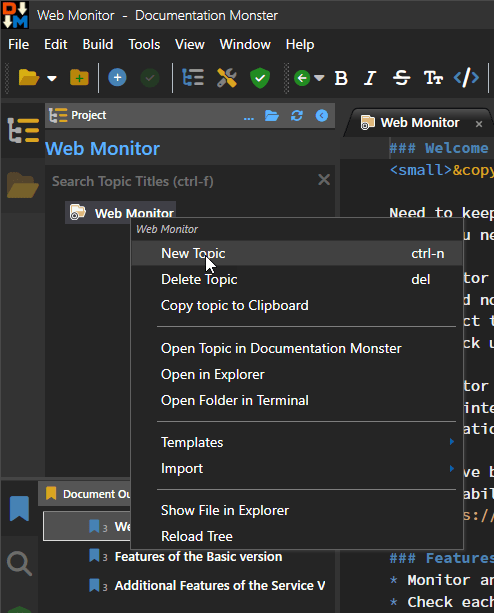
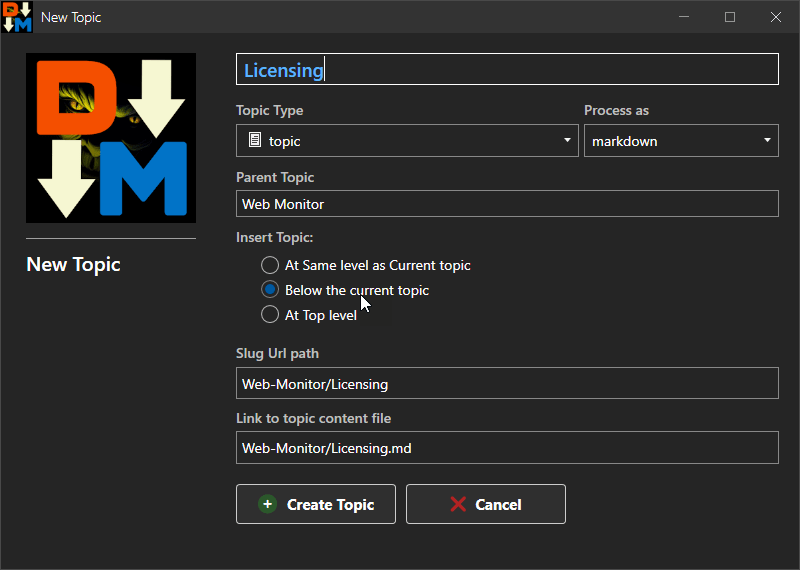
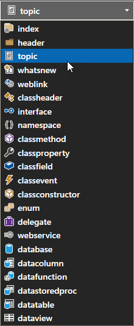

There are several ways to create a new topic:

* `ctrl-n` almost anywhere
* Main Menu: **File -> New Topic**
* Topic Browser Context: **New Topic**

The Topic Tree Context Menu looks like this:

This brings up the New Topic dialog where you get to specify the topic title, topic type and its relation to the parent topic that you started from:

## Title, Slugs and Links
The main item to set on a new topic is the Title which is the display title for the topic. 

As you type a new title DocMonster also pre-sets the Slug and Link based on your relative path in the document hierarchy. The Slug and Link by default use the parent's Slug, plus the current filename in a Url safe format (using *snake case*).

Slug and Link are auto-created, but you can override values here, and later in the topic editor, although it's recommended you stick with assigned names as much as possible.

## Topic Types
Every topic that is created has a **Topic Type** which is determines how the topic is rendered. There are many topic types available and you can add additional types if you choose.

Most commonly you'll only use **header** and **topic**, and perhaps **weblink** and **whatsnew**. Other topic types are for more specific technical documentation scenarios. By convention, topics with chirdren should be header topics but it's not a requirement although there are some special features associated with header specific topic types.

Each topic type has an associated icon which is used in the tree, and also in the topic header of the Html output. A topic type also has an associated html template (ie. `header.html` and `topic.html`) that is associated with it that determines how each topic renders. This allows for fine grained customization of the Html output generated for each topic.

> ##### @icon-lightbulb Doc Monster's Html Templates are customizable
> Doc Monster uses Html and Handlebars Syntax for topic rendering using `{{ Topic.Title }}` style expressions embedded inside of the Html template to generate topic content. You can look at and edit templates by clicking on any topic in the Topic Tree and using the Context Menu to go to **Templates -> Topic Template**, the `_Layout` template, the style sheet etc.

## Insert Topic Relative to Current Topic
New topics are created relative to an existing topic:

* At the same level
* Below
* At the top of the Tree

## Defaults for New Topics
Doc Monster tries to be smart about this and presets this value, so for headers it assumes you want to create a new topic below. For topics it assumes that you like want to create another topic at the same level and so on. 

You can of course change any of the preset values to whatever you need.