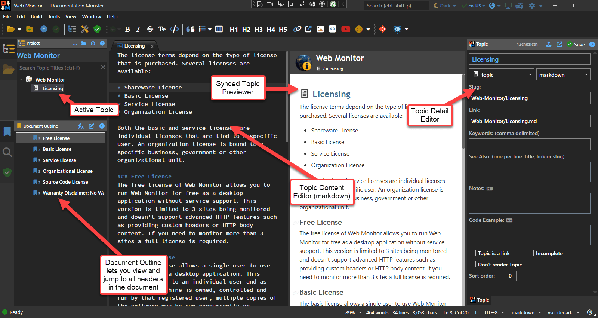

Once you've created a topic the topic exists in the Tree and you can navigate to it to select it and edit it.

There are 4 components in the Documentation Monster UI relevant for topics:

* The Topic Browser and Active Topic
* The Topic Markdown Content Pane
* The Topic Previewer
* The Topic Details Editor

## The Topic Browser 
The topic browser lets you navigate to topics and select them. You can use the tree to navigate or use the search box to filter the tree to show matching topics and their parents.

Click to select a topic.

## The Topic Content Editor
Once a topic has been created, you probably spent most of your time in the Content Markdown Editor to create your actual topic content. 

The editor is based on the powerful [Markdown Monster Editor](https://markdownmonster.west-wind.com) and Doc Monster has most of the same features as that editor - if you've used it before you should feel right at home. Even if you haven't the editor is very easy to work with using standard Markdown conventions and common key combinations like `ctrl-b` and `ctrl-i` for bold and italic, `ctrl-k` for links, `alt-k` for links to other topics `alt-i` for images and so on. All Markdown editing operations are also available from the **Window toolbar** - you can use the tooltips to see shortcuts if you'd rather use keyboard shortcuts. You can also use the Control Pallette (`ctrl-shift-p`) to access operations by name.

The editor has rich support for external content:

* You can paste images from the clipboard into the editor
* You can link images from disk or a Url (`alt-i`)
* You can link to other topics (`alt-k`)
* You can link external links (`ctrl-k` or `ctrl-shift-k`)
* You can paste or create code snippets (`alt-c`)
* You can embed tables
* You can embed YouTube videos and Emoji