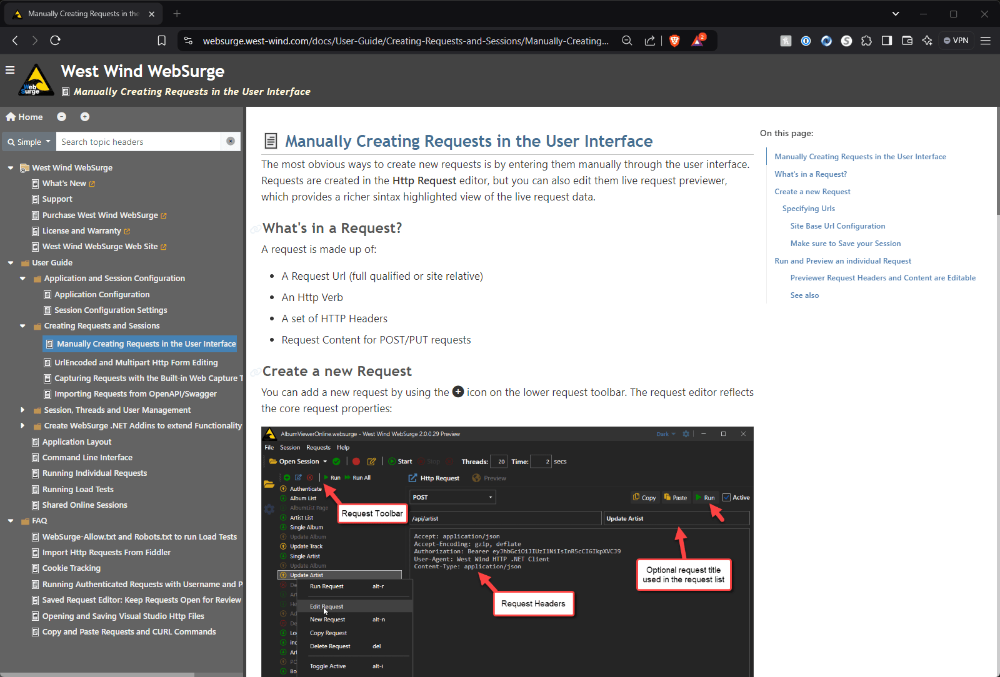
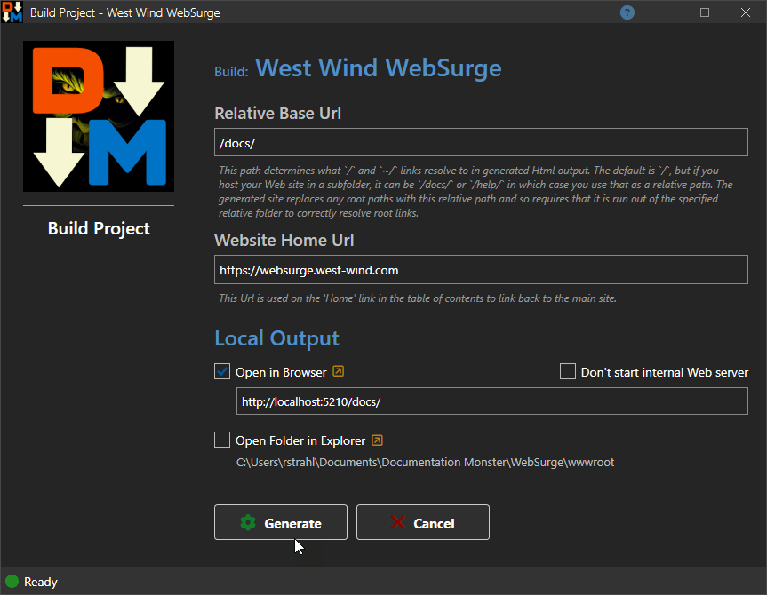
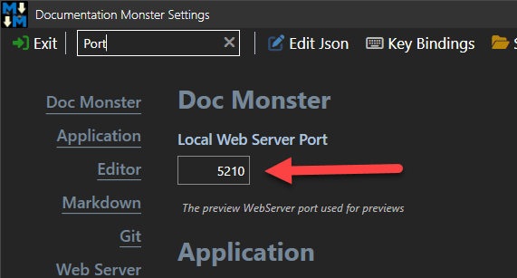
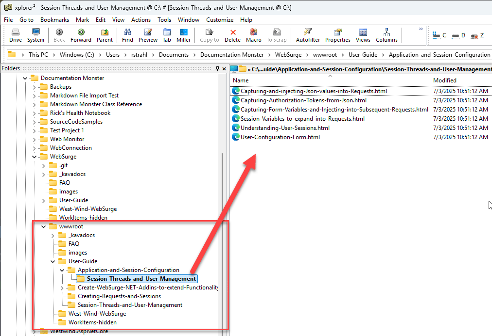

Documentation Monster's primary output mechanism is Html, and when you build your project it produces a self-contained static Web Site that you can easily publish to any Web Server that supports static Web site content.

The Web site consists of an documentation viewer that shows:

* Project Header
* Topic List Navigation Sidebar
* Topic Content Pane

Here's what the generated site looks like:

The site is interactive, so you can search topics, collapse and expand the tree, and navigation is fast as topics are dynamically loaded without having to reload the entire topic tree.

> ##### @icon-warning A Web Server is Required
> In order to 'run' the generated Web site, a Web Server is required. You can't run `index.html` from Windows Explorer or the file system due to dynamically loaded data and content and potentially to a required Relative Base Url <small>(see below)</small>.   
>
> We provide a built-in, local Web server so that you can test the site locally, or you can use [LiveReloadServer](https://github.com/RickStrahl/LiveReloadServer) (separate download) or use our built-in Web Site Packager to create a self-contained executable that can run the packaged site on any Windows 10+ machine.

### Generating Web Site Output
In order to create Web Site output you use **Build -> Build Project Web Site** from the main menu, which brings up the following dialog:

The WebSite is generated into the `/wwwroot` folder of the project with an `index.html` start page that shows the entire project Web site.

#### Generation Options
There are a few options you need to configure once, in order for the Web site to get generated properly.

###### Relative Base Url
Documentation Monster creates a self contained Web Site, but it needs to know the site relative path that identifies the `/` or `~/` path of the Web site, so that navigation can work correctly. You essentially need to specify the Web site relative path where the final Web site or sub-site will be installed.

For example, if I have a product site at `https://markdownmonster.west-wind.com` and I want the documentation to be located at `https://markdownmonster.west-wind.com/docs/` the Relative Base Url is `/docs/`. If I want to run it as a root site for lets say `https://documentation.west-wind.com/` then the Relative Base Path is `/` or empty - ie. the root path of the site.

##### Web Site Home Url
This is Home Url for the Web site that is used in the generated **Home** link on the site. You can override this in the templates, but this is a generic, no-code way to specify the Home link.

##### Output
The Output options relate to locally examining the generated Web site. You can:

* Run the site in a Browser using the built-in local Web server
* Run the site using your own local Web Server ([LiveReloadServer](https://github.com/RickStrahl/LiveReloadServer) for example)
* Open the site in Windows Explorer on disk

> ###### @icon-warning Local Web Server: Admin Rights Required to Activate Local Port
> The local Web Server is based on `http.sys` which unfortunately requires Admin to allow Http access to the given local IP port. When running for the first time, you will likely be prompted by a Windows Security dialog. If you approve the request the port is configured and after that the local site just works unless you choose to use a different port.  
>
> The port used can be configured in the Application settings.  
> 

### Output Location And Format
Documentation Monster generates the Web Site output to the `/wwwroot` folder of the project and runs the Web site from that folder. After generation that folder contains the entire Web site that is self-contained. You can package or move that folder and copy it to another location and it will just work.

You can quickly jump into the output folder via the @icon-up-right-from-square next to the folder name. The folder content matches the structure of the project:

and you can take the entire folder and manually move it if you want to (there are also options on the Publish dialog for folder and zip file copying).

The structure of the `wwwroot` output matches the main project structure with the `Slug` and `Link` files determining the output folder and file names:

* Files are created with the `Link` Filename with an `.html` extension
* Folders are created using the project hierarchy with `Slug` values combined for each level
* Folder level topics are created at the parent folder level with same name as the folder with an `.html` extension.

This format produces clean but potentially long Urls that are contextual via their hierarchical naming. 

> While you can nest topics as deeply as you like, we recommend minimizing too many levels. Besides the excessively long Urls, navigation into multiple nested levels often is tedious, and it can also cause problems on Windows with path lengths exceeding the `MAX_PATH` (260 characters) length for Windows.