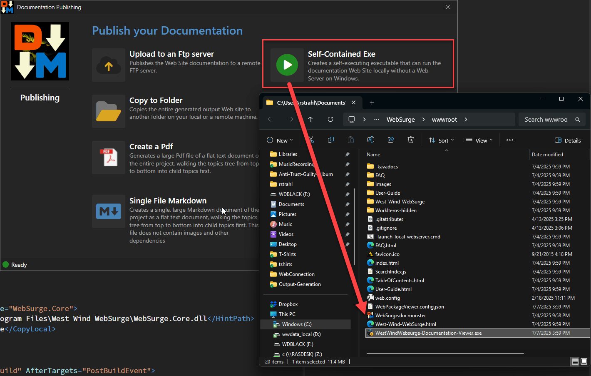
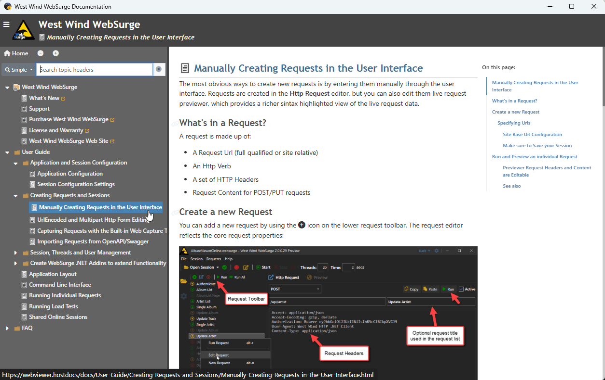

xxx We've often been asked to provide offline documentation that can be distributed, similar to the way you could distribute old Html Help Files (CHM) files to users in the past. The CHM format has long been abandoned, and it uses the completely outdated Web Browser Control that fails with most modern Html content, including the Web site content generated from Documentation Builder.

## Generating an Offline Documentation Viewer for your Project
However, to address this offline viewer scenario - at least for Windows - Documentation Monster provides the ability to package the generated Documentation Web site into a self-contained, single file executable that you can distribute to your customers.

To do this you can use the `Publish your Documentation` dialog:

or click the `Publish` button after you've generated your Web Site output.

Once you select the **Self-Contained Exe** option, a viewer Exe with the project name plus - `Documentation-Viewer.exe` is generated into the `wwwroot` folder of your project. 
## The Generated Self-Contained Documentation Viewer Exe
Here's what the generated Exe looks like when it's run:

The file basically 'runs' the embedded Web site. 

The file can be renamed as you see fit, and can be run from anywhere. All the Web site dependencies are embedded inside of file.

### How does this work?
The viewer works by bundling a small executable that uses a WebView control, plus the Web site content packaged as a Zip file into a single file Exe. When the Exe runs, it unpacks the Zip file into a temp folder and then sets up a local virtual Web site in that folder and navigates the built-in WebView control to that virtual folder Url. 

This essentially provides the ability to run the Web site without an active Web server simply by processing the unpacked folder files locally.

### Requirements
In order to use this Exe you need:

* A recently patched version of Windows 10+

The patch requirement is due to the WebView Runtime requirements that need to be somewhat up to date.