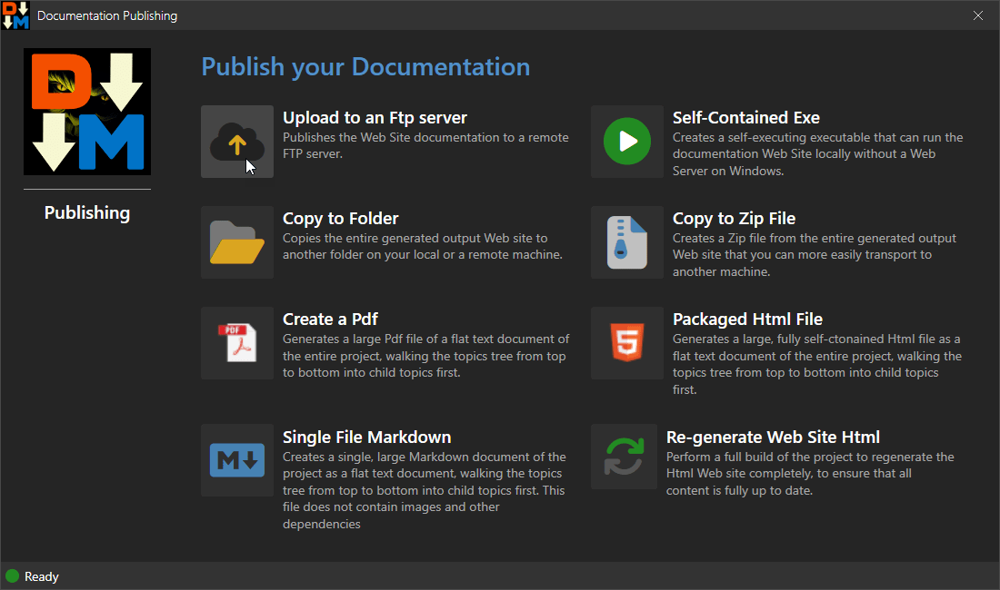

Once you've built your project, you can then publish it in a number of different ways.

There are many ways that you can distribute your generated Html output:

* **Upload to an Ftp Server**  
This allows you to quickly upload your generated output to an Ftp Server for hosting on a Web site. The uploader is efficient, uploading only changed files incrementally.

* **Self-Contained Exe**  
This option produces a self-contained Exe file that allows you to 'run' the documentation offline. The packaged Exe contains both a small executable and the packaged Web site which is unpacked into the temp folder and then run using the built-in Web browser interface. This feature is Windows specific.

* **Copy to Folder and to Zip**  
The Html output for the project is generated into the `wwwroot` folder and this option essentially lets you copy the entire folder and its contents to another folder or a Zip file. This allows you to move the project output to another location easily.

* **Create a Pdf**  
This creates a single file Pdf file that contains the entire documentation as a flat document. The document is rendered top down, go-deep first style walking through topics and combining them into a single document.

* **Packaged Html File**  
Similar to Pdf output, this option creates a single, self-contained Html document that embeds all referenced resources locally into the Html document. This produces a very large, but single file Html document that you can send to anybody to simply open from Explorer, an email etc. Keep in mind this file will be very large however.

* **Single File Markdown**  
Like Pdf and Html output, this option produces a flat Markdown file that contains all the document topics in a single file. This can be useful to feed documentation data to an LLM which are optimized for Markdown input. Unlike the Html and Pdf documents however, the Markdown file does not embed any dependent images, so unless the document is run out of the original root folder those dependencies are not available.